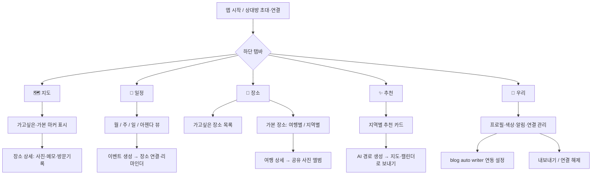
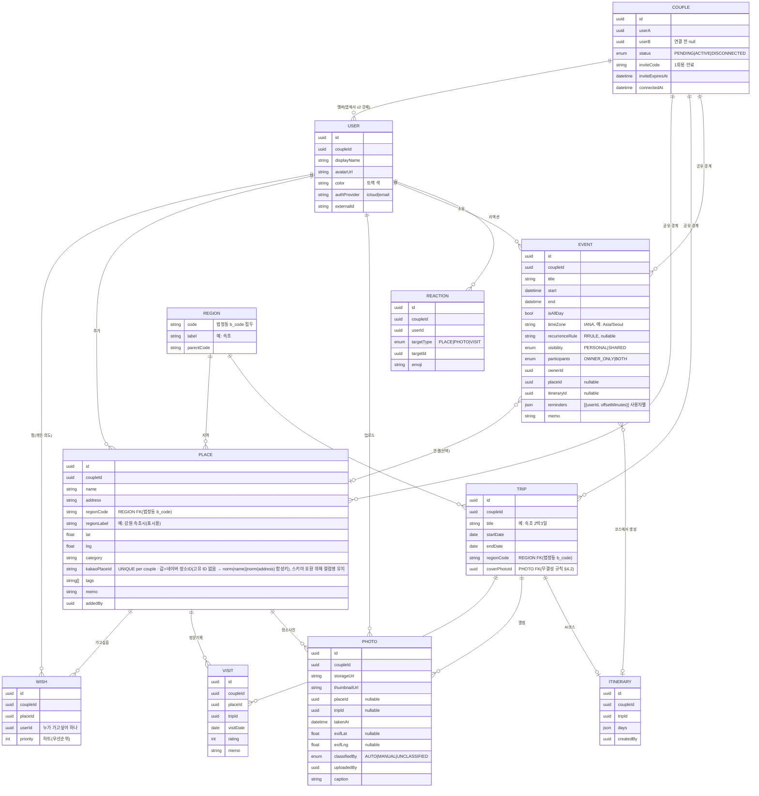

# 둘이 쓰는 여행 관리 앱 — 설계서 (v2)

> 일정 공유 + 가고싶은/가본 장소 + 사진 앨범 + 지도 + AI 추천 경로.
> 사용자 2명(나 + 여자친구), 둘 다 iPhone, UX 최우선.

> **v2 개정 요약 (2026-06-01).** 1차 설계 리뷰에서 나온 High/Medium 지적을 반영했습니다.
> 핵심 변경: ① **스택 결정을 0단계가 아니라 "설계 선행 게이트"로 승격**하고 무엇이 갈리는지 명시(§2) ② **USER·COUPLE 엔티티와 공유 경계(`coupleId`)·동기화/감사 필드를 데이터 모델에 도입**, `Place.status`를 사용자별 `Wish` + `Visit` 도출로 분해(§4) ③ **서버리스 프록시에 인증·레이트리밋·사용량 상한**을 추가(§2.1, §10) ④ **동시편집 충돌·오프라인·휴지통(soft-delete) 정책** 신설(§4.3) ⑤ **사진 블로그 발행을 "복사본+EXIF 스트립+비공개 기본값"으로 재설계**(§7, §10) ⑥ **AI 경로의 운영 계약**(구조화 출력 강제·장소 화이트리스트·영업시간 환각 차단·폴백·편집 UX) 명문화(§5.6) ⑦ 캘린더 종일/반복/타임존, EXIF 자동분류 '제안' 격하, 자동완성 엣지케이스, 접근성, 관계 종료 시 데이터 소유권 등 보강.
> 원본은 `여행관리앱_설계서.v1.md`로 보존했습니다. (검증 패스에서 캘린더 색 도출 규칙·지역(REGION) FK·멤버십 정본·참석자/사용자별 리마인더·운영비(TCO) 표·지도 무료한도 서술을 추가 보정.)

---

## 1. 설계 원칙

이 앱은 일반 서비스가 아니라 **둘만 쓰는 도구**라는 점이 모든 결정을 단순하게 만듭니다. 회원가입 퍼널, 권한 등급, 멀티테넌시 같은 걱정은 거의 필요 없습니다. 대신 **공유가 기본값**이고, "누가 추가했는지" 같은 가벼운 출처 표시와 둘 사이의 실시간 동기화가 핵심 경험이 됩니다.

세 가지를 우선합니다. 첫째, **공유 우선** — 데이터는 기본적으로 둘 다 보고 편집할 수 있고, 개인 영역(내 일정)만 분리합니다. 둘째, **마찰 최소화** — 장소 하나 저장하는 데 탭 3번을 넘기지 않습니다(이 "탭 3번" 목표는 *위시리스트에 장소 저장* 흐름에 한정한 약속이며, 방문 전환·AI 코스 삽입처럼 본질적으로 다단계인 흐름에는 흐름별 목표 탭 수를 따로 둡니다 — §8). 셋째, **iOS 네이티브 감성** — 둘 다 아이폰이므로 안드로이드를 신경 쓸 필요가 없고, 그만큼 제스처·햅틱·전환 애니메이션을 마음껏 네이티브 수준으로 끌어올릴 수 있습니다.

> **단, "둘만"이라는 전제가 곧 "확장성·운영을 무시해도 된다"는 뜻은 아닙니다.** 2인이라도 ① 동시 편집 충돌, ② 사적 데이터(동선·사진) 보호, ③ **관계가 끝났을 때의 데이터 소유권/내보내기**(§10.4)는 반드시 설계해야 하는 현실 문제입니다. v2는 이 셋을 1급 요구사항으로 끌어올렸습니다.

---

## 2. 기술 스택 — 설계의 선행 게이트 (가장 먼저 정해야 함)

1차 설계서는 "나머지 설계는 스택과 거의 무관"이라 적었지만, 이는 **개념적 데이터 모델 수준에서만 참**입니다. 구현·운영 수준에서는 아래 〈스택 분기 표〉의 다섯 축이 스택에 강하게 묶이며, 특히 §7 사진 핸드오프·§8 푸시·§5.4 공유 앨범의 **가능 여부 자체**가 갈립니다. 그래서 스택 결정을 로드맵 0단계가 아니라 **설계 선행 게이트**로 올립니다.

두 가지 현실적인 길이 있습니다.

| 항목 | A안 · 네이티브 (SwiftUI + CloudKit) | B안 · 크로스플랫폼 (Expo/React Native + Supabase) |
|---|---|---|
| UX 완성도 | 최상 (진짜 네이티브) | 매우 좋음 (거의 네이티브) |
| 학습 비용 | Swift/Xcode 필요, Mac 필수 | 이미 웹앱을 만든 경험 그대로 활용 가능 |
| 둘의 동기화·DB | CloudKit 공유 영역(shared zone)이 해결 | Supabase Postgres + Realtime + RLS |
| **외부 API 프록시** | **필요**(카카오·Claude 키 보관·호출) | **필요**(동일) |
| **푸시 인프라** | **별도 필요**(CKSubscription은 변경 알림만, D-day 등 시간 기반은 불가 → APNs 키 + 스케줄러) | **별도 필요**(Edge Function + pg_cron + APNs) |
| **서버에서 데이터 접근** | **불가** — 공유 영역은 서버-투-서버로 못 읽음(클라이언트 경유 강제) | 가능(Edge Function이 DB 직접 접근) |
| 로그인 | iCloud 계정 = 신원 (구현 0) | 직접 구현 (둘이라 간단, 단 RLS 정책은 설계 필요) |
| 사진 저장·**외부 공개 URL** | CKAsset(외부 공개 URL 개념 없음 → 블로그 발행용 별도 호스팅 필요) | Supabase Storage(서명/공개 URL 자연 지원) |
| 비용 | 사실상 무료(개인 iCloud 한도 내, 단 5GB 무료·사진 압박) | 무료 티어 시작(단 **무료 프로젝트 7일 미사용 시 자동 일시정지** → keep-alive 또는 Pro $25/월) |
| 나중에 웹으로 확장 | 어려움 | 쉬움 |

**무엇을 정하면 무엇이 갈리는가 (스택 분기 표):**

| 결정 축 | A안에서 | B안에서 | 판단 기준 |
|---|---|---|---|
| 사진 블로그 핸드오프(§7) | CKAsset → 공개 URL 없음, **발행용 복사·호스팅 단계 필수** | Storage 공개/서명 URL로 자연스러움 | 블로그 연동 비중이 크면 B안 유리 |
| 서버 측 처리(§5.6 AI·§7) | 불가 → 전부 클라이언트가 프록시 호출 | Edge Function에서 서버 처리 가능 | 서버 로직 필요하면 B안 |
| 지도 UX(§5.5) | 카카오맵 iOS SDK 네이티브로 매끄러움 | RN은 서드파티/WebView 의존(아래 주의) | 지도가 제품의 심장이면 A안 |
| 프라이버시(§10) | 데이터가 둘의 iCloud에 머묾 | RLS로 통제(설계 필요) | 둘 다 가능, A안이 기본 우위 |
| 학습/속도 | Swift 학습 비용 | 기존 JS 역량 즉시 재사용 | 빨리 쓰기 시작하려면 B안 |

**추천:** 빠른 출시와 웹 연동·서버 처리(블로그)가 중요하면 **B안(Expo + Supabase)**, "끝까지 폴리시된 네이티브 지도 감성"과 "둘의 iCloud에 머무는 프라이버시"가 최우선이고 Swift 학습이 부담스럽지 않다면 **A안(SwiftUI + CloudKit)**입니다. 어느 쪽이든 위 분기 표를 먼저 결정해야 §5.4·§7·§8 설계가 공회전하지 않습니다.

> 이 문서의 데이터 모델·기능·UX는 두 안 모두에 적용됩니다. 스택을 정하면 그 스택 기준 구현 디테일(SDK, 라이브러리, 코드 골격)을 더 채워드립니다.

### 2.1 공통 백엔드 레이어 — 서버리스 프록시 (인증·한도 포함)

어느 안이든 **API 키를 앱에 박으면 안 됩니다.** 카카오 로컬 API와 AI 경로 생성(Anthropic API) 호출은 얇은 서버리스 함수(Vercel / Cloudflare Workers / Supabase Edge Functions)를 프록시로 두고 그곳에서 키를 보관해 호출합니다. 앱 → 내 서버리스 함수 → 카카오/Claude 순서입니다.

**다만 "키를 숨기는 것"만으로는 부족합니다.** 인증 없는 프록시는 *오픈 프록시*가 되어 제3자가 카카오 쿼터를 소진하거나 **내 명의 Anthropic API를 도용해 과금 폭탄**을 일으킬 수 있습니다(토큰당 과금). 그래서 프록시는 다음을 갖춥니다.

1. **호출자 인증** — 둘(우리 커플)만 호출하도록 토큰 검증. B안은 Supabase JWT를 그대로 검증, A안은 앱이 가진 짧은 자체 토큰(또는 iCloud 신원 기반 발급)을 검증.
2. **레이트리밋 + 월 사용량 상한** — 엔드포인트별 분당/일당 한도와 **월 비용 상한**(특히 Claude). 상한 초과 시 친절히 거절.
3. **iOS App Attest / DeviceCheck** — 정품 앱에서 온 호출인지 단말 차원 검증(선택, 강화용).
4. **결과 캐싱** — 동일 입력(같은 장소셋·제약)의 AI 코스 결과를 캐싱해 비용·지연 절감. 자동완성은 짧은 TTL 캐시.
5. **런타임 선택** — 자동완성처럼 지연이 민감한 호출은 엣지 런타임(CF Workers)으로 콜드스타트를 줄이고, AI 경로처럼 오래 걸리는 호출은 충분한 실행시간 한도를 가진 런타임/비동기 패턴으로.

---

## 3. 정보 구조(IA) & 네비게이션

하단 탭바 5개로 구성합니다. 각 탭은 하나의 명확한 질문에 답합니다.



- **🗺️ 지도** — 앱의 첫 화면. "우리가 가고 싶은 곳"과 "가봤던 곳"이 한눈에.
- **📅 일정** — 나/상대/함께 캘린더.
- **📍 장소** — 위시리스트와 방문 기록의 본진.
- **✨ 추천** — 데이터가 쌓이면 살아나는 탭.
- **💑 우리** — 설정, 연동, 둘의 프로필, **연결 관리·내보내기**.

---

## 4. 데이터 모델

스택과 무관한 개념 모델입니다. CloudKit이면 레코드 타입, Supabase면 테이블로 1:1 매핑됩니다. 핵심 아이디어는 **여행(Trip)** 묶음으로 "장소별·날짜별 보기"를 자연스럽게 푸는 것이며, v2에서는 **공유 경계(Couple)·사용자(User)·동기화/감사 필드**를 명시해 "둘이 공유"의 근간과 충돌 해결을 모델에 새깁니다.

### 4.1 ER 다이어그램



### 4.2 설계상 중요한 선택

- **공유 경계는 `coupleId` 하나로 통일.** USER·PLACE·TRIP·PHOTO·EVENT·VISIT·ITINERARY·WISH·REACTION 모든 공유 테이블이 `coupleId`를 가집니다. 이게 **RLS(B안) / CloudKit 공유 영역(A안)의 단일 기준 키**이며, §10의 "이 두 사용자만 접근"을 거는 컬럼입니다. COUPLE은 둘을 묶고 초대 상태(PENDING/ACTIVE/DISCONNECTED)와 1회용 초대코드를 보관합니다. **멤버십의 정본은 `COUPLE.userA/userB`이고 `USER.coupleId`는 비정규화 캐시**입니다(둘이 어긋나면 COUPLE을 신뢰). 생성 순서는 ① COUPLE을 PENDING으로 만들고 초대코드 발급 → ② 수락 시 `userB`와 각 `USER.coupleId`를 채움 → ③ `status=ACTIVE`. "정확히 2인"은 ERD 카디널리티로는 표현되지 않으므로 앱 레이어에서 멤버 ≤2를 강제합니다.

- **`Place.status`를 없애고 "가고싶음/가봤음"을 도출로 분해.** 1차안의 단일 `status`(WANT|VISITED)는 ① "A는 가봤고 B는 아직", ② "가본 곳을 또 가고싶음"을 표현하지 못하고, ③ 공유 단일 레코드라 한 명이 VISITED로 바꾸면 다른 한 명의 위시에서도 사라지는 문제가 있었습니다. v2는:
  - **가고싶음 = `Wish` 존재**(사용자별 의도, `priority`=하트). 둘이 각자 찜할 수 있고, 가본 곳도 다시 찜할 수 있습니다.
  - **가봤음 = `Visit` 존재**(파생). 별도 status 플래그를 두지 않으므로 "VISITED인데 Visit 0건" 같은 불일치가 원천 차단됩니다.
  - 화면의 "가고싶은/가본" 필터는 이 두 도출값으로 계산합니다. (저장된 status가 필요하면 캐시 컬럼으로 두되 `Visit≥1 ⇔ visited` 불변식을 트리거/앱 레이어로 강제.)

- **`Visit`를 별도 테이블로** 둔 덕에 같은 장소를 두 번 가도(예: 좋아하는 강릉 카페) 방문이 각각 남고, 여행(Trip)에 묶입니다.

- **하트 vs 리액션 분리.** "우선순위 하트"는 `Wish.priority`(개인 의도의 세기), "❤️ 누가 눌렀나"는 `REACTION{userId, targetType, targetId, emoji}`로 분리합니다(§8). 둘은 의미가 다르므로 한 필드(`hearts:int`)로 섞지 않습니다.

- **EVENT.calendar(MINE|PARTNER|SHARED) 중복 제거.** 저장은 `visibility(PERSONAL|SHARED)` + `ownerId`만 합니다. 화면의 "나(블루)/상대(핑크)/함께(퍼플)" 트랙은 런타임에 도출합니다 — `SHARED`면 함께(퍼플), `PERSONAL`이면 소유자 기준 색(내가 소유=나/블루, 상대가 소유=상대/핑크). **둘은 한 캘린더를 공유하므로 PERSONAL 일정도 서로 보이고 색만 소유자로 갈립니다** — 그래서 '상대(핑크)' 트랙이 항상 채워져 §5.1의 3트랙·칩과 일치합니다(상대에게 완전히 숨기는 '진짜 비공개' 일정은 신뢰 기반 2인 앱의 기본 범위 밖이며, 필요하면 별도 플래그로 확장).

- **종일/반복/타임존/참석/리마인더.** EVENT에 `isAllDay`, `timeZone(IANA)`, `recurrenceRule(RRULE)`를 둡니다. Trip은 본질적으로 여러 날 종일 범위이므로 캘린더에 종일 배너로 그립니다. 둘이 다른 타임존에 있어도 시각이 어긋나지 않습니다. 참석 범위는 `participants(OWNER_ONLY|BOTH)`로, 리마인더는 **사용자별** `reminders=[{userId, offsetMinutes}]`로 두어 둘의 알림 시각을 따로 잡습니다. 반복 일정의 특정 회차 수정·삭제는 RRULE의 `EXDATE`/`RECURRENCE-ID` 규약으로 예외를 저장합니다.

- **`region`은 코드 + 표시명 이원화.** 자유 문자열 그룹키는 오타·행정구역 개편에 취약하므로, `REGION` 마스터(법정동 b_code 접두)를 두고 `PLACE.regionCode`·`TRIP.regionCode`가 FK로 참조하고, `regionLabel`은 표시용 캐시입니다. 카카오 주소를 파싱해 코드/라벨을 자동 채웁니다("강원특별자치도 속초시 ..." → code=강원 속초, label="속초"). 이게 "지역별 보기"의 안정적 그룹 키가 됩니다.

- **사진 소속 모호성 명문화.** `PHOTO.placeId`·`tripId`는 모두 nullable이며, **둘 다 null인 "미분류(UNCLASSIFIED)"를 정식 상태로 인정**합니다(§5.4). `classifiedBy`로 자동/수동/미분류를 구분합니다.

- **`coverPhotoId`·`ITINERARY` 무결성.** Trip 커버 사진은 같은 `coupleId`의 PHOTO여야 하고, 사진 삭제 시 커버는 null로 폴백합니다. `ITINERARY.days`는 당장은 JSON blob으로 두되, 후보 코스 비교가 필요해지면 stops를 정규화 테이블로 분리합니다.

### 4.3 동기화·충돌·삭제 정책 (신설)

실시간 공유가 핵심인 만큼, "둘이 동시에 같은 항목을 만질 때"와 "이동 중 약전파"를 1차안이 비워둔 채로 둘 수 없습니다.

- **감사·동기화 필드 표준.** 모든 변경 가능한 공유 테이블은 `createdAt / updatedAt / createdBy / updatedBy / deletedAt / version`을 공통으로 가집니다(ER 다이어그램에서는 가독성을 위해 생략, **전 테이블 적용**).
- **충돌 감지(낙관적 락).** 저장 시 `version`을 비교해, 서버 버전이 더 높으면 **무음 덮어쓰기(LWW) 대신 충돌을 감지**합니다. CloudKit은 `serverRecordChanged`를 앱에서 처리, Supabase는 `version` 조건부 update로 막습니다. memo·priority처럼 손실이 아까운 필드는 필드 단위 머지/append를 고려합니다.
- **삭제 = 휴지통(soft-delete).** `deletedAt`만 채우고 실제 삭제는 유예합니다. "상대가 지운 우리 추억"을 양쪽 모두 일정 기간 복구할 수 있습니다(§8 출처·정서 철학과 일관).
- **오프라인 큐잉.** 여행 앱은 본질적으로 이동 중·약전파에서 쓰입니다. 쓰기를 로컬 큐에 쌓아 재연결 시 동기화하고, 충돌은 사용자에게 표시합니다. 이 시나리오를 §9 단계 1부터 테스트에 포함합니다.

---

## 5. 기능별 상세 설계

### 5.1 일정 — 3트랙 공유 캘린더

세 개의 논리 트랙을 색으로 구분합니다: **나(예: 블루)**, **상대(핑크)**, **함께(퍼플)**. 저장은 `visibility(PERSONAL|SHARED)` + `ownerId`로만 하고, 트랙 색은 보는 사람 기준으로 도출합니다 — SHARED=함께(퍼플), PERSONAL=소유자 색(나/상대). 둘은 한 캘린더를 공유하므로 PERSONAL 일정도 서로 보입니다(§4.2). 구글 캘린더처럼 오버레이로 한 화면에 겹쳐 보되, 상단 칩으로 각 트랙을 켜고 끌 수 있습니다.

차용할 UX 레퍼런스: 큰 틀과 인터랙션(월/주/일/아젠다 뷰, 색상 오버레이, 길게 눌러 생성, 드래그로 이동)은 **구글 캘린더**, *커플·가족 공유 캘린더의 정석*인 **TimeTree**(둘이 한 캘린더를 공유, 일정에 코멘트·사진 — 거의 그대로 벤치마크), 깔끔한 타이포·키보드 중심 UX는 **Notion Calendar(구 Cron)**를 참고하세요.

이벤트는 제목·시간·**종일 여부·타임존·반복(RRULE)**·**장소 연결(선택)**·메모·소유자/가시성·**참석 범위(OWNER_ONLY|BOTH)**·**사용자별 리마인더**를 가집니다(둘이 각자 다른 시각으로 알림, 반복 일정의 특정 회차 예외는 EXDATE/RECURRENCE-ID). 핵심 연결고리: 이벤트에 `Place`를 붙이면 그 일정이 지도·장소 탭과 이어지고, AI가 짠 코스를 **"함께" 캘린더에 그대로 꽂을 수 있습니다**(이때 `itineraryId`로 코스 출처를 남깁니다). TimeTree를 벤치마크하는 만큼 **종일 일정·반복 일정은 MVP 이후라도 협상 불가 항목**으로 둡니다.

동기화는 B안이면 Supabase Realtime, A안이면 CloudKit 공유 영역으로 자동 전파되며, 충돌은 §4.3 정책을 따릅니다. MVP에서는 앱 안에 일정을 두고, 원하면 나중에 각자의 애플/구글 캘린더로 구독(.ics) 내보내기를 추가합니다.

### 5.2 가고싶은 장소 — 네이버 지역검색 자동완성

추가 흐름은 검색 한 줄에서 끝납니다. 입력하면 **네이버 지역검색**(자동완성, 프록시 경유)을 디바운스(약 250ms)로 호출해 드롭다운에 후보를 띄우고, 선택하면 이름·주소·좌표·카테고리·장소 ID/URL이 한 번에 저장됩니다. 거기에 메모·태그(`PLACE.tags`)·하트(`Wish.priority`)만 가볍게 얹습니다. 저장은 `Place`(공유) + 누른 사람의 `Wish`(개인 의도)로 나뉩니다.

```
입력 "속초 칠" → [디바운스 250ms] → 서버리스 프록시 → 네이버 지역검색
   → ["칠성조선소", "칠성식당", ...] 드롭다운
   → 탭 → Place(coupleId, regionCode="강원 속초", regionLabel="속초") + Wish(userId=나, priority)
```

좌표를 저장하므로 지도 마커와 추천 클러스터링에 바로 쓰입니다. 네이버 지역검색 API의 무료 쿼터는 2인 규모 추정 호출량 대비 충분해 보이나, 출시 전 개발자 콘솔에서 지역검색의 현재 일/월 쿼터를 확인하세요.

**엣지케이스(정상 흐름만큼 중요):**

| 상황 | 처리 |
|---|---|
| 검색 결과 0건 | "직접 입력" 폴백(이름·주소·핀 찍기) 제공 |
| 오프라인/타임아웃 | 인라인 에러 + 재시도, 입력값 보존 |
| 같은 장소 중복 저장 | `kakaoPlaceId` UNIQUE(per couple)로 감지 → 기존 카드로 점프, 내 `Wish`만 추가 (값=네이버 장소ID(고유 ID 없음 → norm(name)\|norm(address) 합성키), 스키마 호환 위해 컬럼명 유지) |
| 디바운스 중 stale 응답 | 요청에 취소 토큰을 붙여 늦게 온 옛 응답은 무시(race 방지) |

### 5.3 가본 장소 — 여행별 · 지역별 보기

"속초, 강릉 등 장소별·날짜별로 쉽게"라는 요구는 **Trip(여행) 묶음**으로 풉니다. 며칠간 한 지역을 다녀오면 하나의 Trip("속초 2박3일", 날짜 범위)이 되고, 그 안에 방문(Visit)과 사진이 담깁니다.

두 가지 보기를 제공합니다. **여행별(타임라인)** — 최근 여행부터 카드로, 각 카드에 커버 사진·지역·기간·장소 수. **지역별** — `regionCode`로 그룹핑해 한 지역을 누르면 그곳의 모든 방문이 시간순으로. 위시리스트에서 가본 곳으로의 전환은 장소 상세에서 "다녀왔어요"를 누르고 날짜·여행을 고르면 `Visit`이 생기는 것이며(상태 플래그 변경이 아니라 기록 추가), 이 흐름은 다단계이므로 "탭 3번" 약속의 대상이 아닙니다(§8 흐름별 목표 탭 수).

### 5.4 사진 — 장소별 공유 앨범

각 **여행 또는 장소**에 둘이 함께 채우는 공유 앨범이 붙습니다. 분류는 **자동 '제안' + 수동 확정**입니다. 업로드 시 EXIF의 촬영 시각·위치(`exifLat/exifLng`)로 어느 여행/장소에 속하는지 **추정해 제안**하되, **자동으로 확정하지 않습니다** — 사용자가 1탭으로 수락/변경하며, 자동 배정에는 '자동' 배지를 답니다.

> **왜 '제안'으로 격하했나.** 스크린샷·메신저로 받은 사진엔 GPS가 없고, 카메라 시계 오설정·여행 기간 밖 촬영·iOS 사진 위치 권한 미허용으로 위치가 비는 경우가 흔합니다. 자동 확정은 오분류를 양산합니다.

- **GPS 없음** → 촬영 시각으로 Trip만 추정, 장소는 수동.
- **아무 것도 못 맞춤** → **'미분류(UNCLASSIFIED)' 트레이**에 모아 두고 나중에 정리(정식 상태, §4.2).
- 필터 칩(여행 / 지역 / 날짜 / 태그)으로 추려 보고, 지도 마커를 누르면 그 장소의 사진만 모아 봅니다.

저장 전략은 스택에 따릅니다 — B안은 Supabase Storage에 원본+썸네일을 올리고 URL을 `Photo`에 기록, A안은 CKAsset 또는 iOS 공유 앨범 연동을 활용합니다(단 A안은 외부 공개 URL이 없어 §7 블로그 발행 시 별도 호스팅 필요, iCloud 5GB 무료 한도로 사진이 늘면 외부 스토리지 권장). 어느 쪽이든 그리드는 썸네일만 지연 로딩하고 원본은 탭할 때 받습니다(사진이 가장 무거운 비용 요인).

### 5.5 지도 — 별표 마커로 한눈에

> **한국 지도 주의점:** 구글 지도는 국내 지도 데이터 반출 규제로 길찾기·상세가 오랫동안 제한적이었습니다(2026-02 정부가 조건부 반출 허가를 의결해 과도기 — 실제 서비스 개시·범위는 확정 전). 어느 쪽이든 **카카오맵 / 네이버 지도 SDK**가 국내 데이터·길찾기에서 우위입니다. 단 무료 조건이 다릅니다: **네이버 모바일 동적 지도는 무료 제공량이 없습니다**(2023년 요금 개편으로 무료 대상에서 제외, 2025-03 무료 이용량 중단·신규 신청 차단 예고 → 뷰 단위 종량 과금). 카카오맵은 상대적으로 무료 한도가 있는 것으로 알려져 있으나, **두 SDK의 2026년 현재 무료 한도는 출시 전 공식 가격 페이지에서 재확인**하세요. **권장 1순위는 카카오맵**입니다.
>
> D5(2026-06 확정): 지도 표시 정본 = 네이버 지도 JS SDK v3. 위 카카오맵 1순위 서술은 결정 근거 보존용(카카오 코드는 롤백용 보존, 현재 미사용).
>
> **RN(B안) 주의:** 카카오는 공식 RN SDK가 없어 커뮤니티 라이브러리/네이티브 모듈/ WebView에 의존하고, 네이버는 서드파티 RN 라이브러리가 있으나 Expo Dev Build가 필요합니다. WebView 방식은 커스텀 마커·클러스터링에 제약이 큽니다 → 네이티브 모듈 우선, MVP는 마커를 단순화. **이 지도 연동 난이도는 A안(네이티브) 선택의 실질 근거**가 됩니다.

마커는 **별표 모양**을 차용하되 상태로 구분합니다 — 가고싶은 곳은 *빈/컬러 별*, 가본 곳은 *채워진 별 + 체크*. 줌아웃 시 클러스터링(SDK 내장 클러스터링 우선)하고, 마커를 누르면 미니 카드(이름·사진 1장·상태)가 뜨고 상세로 진입합니다. 상단 필터로 "가고싶은 / 가본 / 전체"를 토글합니다(상태는 §4.2의 Wish/Visit 도출값). 둘이 추가한 장소를 작은 아바타 점으로 출처 표시하면 "이거 네가 찜한 데네" 하는 재미가 생깁니다.

### 5.6 추천 & AI 경로 생성

**추천 트리거:** 같은 지역의 *가고싶은 장소*가 임계치(예: 3~5개) 이상 쌓이면 추천 탭에 카드가 뜹니다 — "강릉에 가보고 싶은 곳 5개가 모였어요. 코스로 짜볼까요?" 좌표 기준으로 위시를 지역·근접도로 클러스터링해 후보 여행을 제안합니다.
> **콜드스타트 보완:** 데이터가 없으면 추천 탭이 비어 '죽은 탭'이 됩니다. 초반에는 회고형("지난 속초 여행 다시 보기")·시드 추천으로 채워 빈 인상을 피합니다.

**경로 생성(AI):** "경로 짜기"를 누르면 선택한 장소들과 제약(여행 날짜, 인원=2, 이동수단, 페이스: 느긋/빡빡, 선호: 맛집 위주 등)을 **Anthropic API(Claude)**로 보내 일자별 최적 동선을 받습니다.

**설계 포인트**

- **왜 순수 알고리즘이 아니라 AI인가** — TSP는 "순서"는 주지만 "오전엔 바닷가, 점심은 근처 맛집, 오후엔 카페" 같은 맥락·끼니 배치·자연어 설명을 못 줍니다. 둘을 결합하세요: 좌표로 대략적 최근접 순서를 미리 계산 → Claude가 다듬고 끼니·휴식·이유를 채움.
- **운영 계약 (v2 신설 — 그럴듯하지만 틀린 코스 방지):**
  - **구조화 출력 강제** — Anthropic의 structured outputs(`json_schema` strict) 또는 tool use(strict)로 JSON을 강제하고, 프록시에서 zod/ajv로 검증 후 실패 시 1회 재시도. `stop_reason`이 `end_turn`이 아니면 가드. (구조화 출력은 정식 지원되므로 설계를 강하게 가도 됩니다.)
  - **장소 화이트리스트 검증** — 응답의 각 stop은 **입력으로 보낸 `placeId` 집합 안에 있어야** 채택. 없는 장소(환각)는 거부.
  - **영업시간 환각 차단** — 네이버 지역검색(D5 정본; 카카오 로컬 검색도 동일)은 **영업시간을 반환하지 않습니다**(PLACE 모델에도 없음). 출처 없는 영업시간을 AI가 지어내지 못하도록 **AI에 영업시간 추정을 금지**하고, 별도 출처를 확보하기 전엔 코스에 "영업시간 미반영" 면책을 표시합니다.
  - **결정론적 후처리** — 도착시각 = 직전 도착 + 체류분 + 구간 이동시간으로 앱이 재계산(AI의 산술을 신뢰하지 않음). 영업시간 출처가 생기면 창과 대조.
  - **폴백** — 타임아웃·5xx·콜드스타트 시 "좌표 TSP 순서 + 카테고리 기반 끼니 슬롯"의 결정론 폴백을 제공(최소한 순서는 나옴).
- **실제 이동시간** — 카카오모빌리티(내비) 또는 TMap 길찾기로 구간별 소요시간을 받아 AI 입력/폴리라인에 씁니다(국내 길찾기는 카카오/TMap 권장. 무료 한도: 카카오모빌리티 자동차 길찾기 일 1만 건, TMap 경로안내 일 1,000건 수준으로 2인 규모엔 충분). 호출은 **순서를 먼저 고정한 뒤 인접 구간 N−1회만** 단방향으로 받아 O(N²)·순환 의존을 피하고, 대표 소요시간은 캐시합니다.
- **입출력 계약** — 입력: 장소 배열(이름·좌표·카테고리)+제약 JSON. 출력: 구조화 JSON(`days[] → stops[] {placeId, 도착시각, 체류분, 이동메모, 추천이유}`).
- **편집 UX** — 생성 코스는 **편집 가능한 초안**으로 다룹니다. 사용자가 stop을 고정(핀)하거나 빼고 **부분 재생성**할 수 있어야 단방향의 답답함이 없습니다.
- **루프 닫기** — 완성된 코스는 ① 지도에 동선 폴리라인으로 그리고 ② "함께 캘린더에 추가"로 일정 이벤트들을 자동 생성합니다(`itineraryId` 출처 보존). 추천 → 코스 → 일정 → 여행 후 사진/방문기록까지 한 바퀴 도는 경험이 이 앱의 차별점입니다.

---

## 6. 외부 연동 요약

| 용도 | 추천 | 비고 |
|---|---|---|
| 장소 검색·자동완성 | **네이버 지역검색 API** | 무료 쿼터, 한국 장소 강함, 좌표·카테고리·장소 URL 제공. **영업시간은 미반환**(§5.6) |
| 지도 표시 | **네이버 지도 JS SDK v3(정본 — D5)** / 카카오맵(롤백 보존) | 구글은 국내 규제로 부적합. 지도 표시 정본 = 네이버 지도 JS SDK v3(D5 확정); 카카오맵은 롤백용 보존(현재 미사용), 현재 한도는 공식 페이지 확인 |
| 길찾기·이동시간 | 카카오모빌리티 / TMap API | AI 입력·동선 폴리라인용. 일 한도 충분 |
| AI 경로 생성 | **Anthropic API (Claude)** | 서버리스 프록시 경유, **structured outputs(strict)로 JSON 강제** |
| 인증·DB·실시간·사진 | A안 CloudKit / B안 Supabase | 스택 결정에 종속(§2 분기 표) |

모든 외부 키는 앱이 아니라 **인증·레이트리밋·사용량 상한을 갖춘** 서버리스 프록시에 보관합니다(§2.1).

---

## 7. blog auto writer 연동

> 블로그가 정적 사이트(Jekyll/GitHub Pages 계열)로 보이는데, blog auto writer의 실제 형태(웹 서비스인지, 글 생성기인지)에 따라 *전송 방식*이 갈립니다. 그래서 **전송 방식과 무관하게 안정적인 데이터 계약(payload)**부터 정의하고, 거기에 맞는 운반책을 제시합니다.

**프라이버시 우선 원칙(§10과 일관):** 블로그로 보내는 행위는 **명시적 공개**입니다. 그 외 모든 데이터는 비공개가 기본값입니다. 그래서 발행 시:

- 앱/프록시가 원본 사진을 **복사 → EXIF/GPS 스트립 → 리사이즈 → 공개 경로에 새로 업로드**하고, 페이로드에는 **그 가공본 URL만** 넣습니다. (원본의 GPS·촬영시각이 그대로 나가면 집·동선이 의도치 않게 공개됩니다.)
- 비공개 앨범의 서명 URL을 그대로 넘기지 않습니다(발행 후 만료로 깨지거나, 영구 공개 시 §10 붕괴).

**핸드오프 페이로드(고정 스키마):**

```json
{
  "place": "칠성조선소",
  "region": "속초",
  "dates": ["2026-05-10", "2026-05-11"],
  "coordinates": { "lat": 38.20, "lng": 128.59 },
  "memo": "뷰가 좋았던 카페, 노을 추천",
  "mapUrl": "https://...",
  "photos": [
    { "url": "https://.../published/1.jpg", "caption": "노을", "takenAt": "..." }
  ]
}
```
> `photos[].url`은 EXIF가 제거된 **발행용 가공본**입니다(원본 비공개 URL 아님).

**운반책 (blog auto writer 형태에 맞춰 택1):**
1. **REST/Webhook** — 웹 서비스라면 `POST /import`로 위 JSON 수신. 가장 깔끔.
2. **정적 블로그용 초안 생성** — Jekyll이라면 프론트매터가 박힌 `_drafts/2026-05-10-속초-칠성조선소.md` 초안과 이미지(가공본)를 GitHub API로 푸시. 단, **GitHub 토큰은 앱이 아니라 프록시 경유**, 자동 발행 대신 `_drafts`/PR로 사람이 확인, 이미지는 외부 CDN, 파일명은 ASCII 슬러그 권장.
3. **iOS 공유 시트 / 단축어(Shortcuts)** — 앱이 공유 액션으로 선택 사진(가공본)+캡션을 넘김. **코딩 최소라 MVP 1순위 권장.**

스키마는 고정해 두고 운반책만 교체하면 되므로, blog auto writer의 실제 형태를 알려주면 한 가지로 좁혀 설계해드립니다.

---

## 8. UX 디테일 (둘만 쓰는 앱의 강점 살리기)

iOS HIG를 따르되 둘만의 도구라는 점을 살립니다. SF Symbols·라지 타이틀·스와이프·롱프레스 컨텍스트 메뉴·당겨서 새로고침을 기본으로 쓰고, 장소 저장 시 하트 애니메이션·마커 드롭·탭 전환에 부드러운 모션과 햅틱을 넣습니다.

둘만의 경험: 모든 항목에 **누가 추가/편집했는지** 작은 아바타로 출처를 표시하고, 장소·사진·방문기록에 가벼운 ❤️ **리액션**(`REACTION` 모델)을 허용하되 무거운 소셜 기능은 넣지 않습니다. 알림은 일정 리마인더 외에 "상대가 새 장소를 추가했어요", "○○ 여행 D-3" 같은 둘 사이의 신호로 한정합니다.

**"탭 3번" 원칙의 적용 범위.** 이 목표는 *위시리스트에 장소 저장*에만 적용합니다. 본질적으로 다단계인 흐름은 별도 목표를 둡니다:

| 흐름 | 목표 |
|---|---|
| 위시 장소 저장 | ≤ 3탭 (원칙) |
| 가본 곳으로 전환(날짜·여행 선택) | ≤ 5탭 |
| AI 코스 생성 → 캘린더 삽입 | 가이드형 다단계(탭 수 대신 단계별 명확성) |

**접근성·시스템(신설).** 트랙/상태를 색만으로 구분하지 않고 **색 + 패턴/라벨로 이중화**(색각 이상 대응), VoiceOver 라벨, Dynamic Type(큰 글자), Reduce Motion(모션 축소), 다크 모드를 기본 지원합니다.

**알림 권한.** 첫 실행에 무턱대고 요청하지 않고 **맥락에서 요청**(예: 첫 리마인더 설정 시), 거부 시 **인앱 활동 피드**로 폴백해 "상대가 추가함" 신호를 앱 안에서라도 보여줍니다.

온보딩은 최소화합니다 — 상대 초대/연결, 캘린더 색상 두 개 고르기, **위치/사진 공유 상호 동의**(§10.3)로 끝. 빈 상태도 친근하게("첫 가고싶은 장소를 추가해보세요"), 그리고 데이터가 쌓이기 전 추천 탭 등 **다층 빈 상태**를 설계합니다.

---

## 9. 개발 로드맵

데이터가 쌓여야 가치가 생기는 앱이므로, **위시리스트+지도**부터 만들어 빨리 쓰기 시작하는 게 핵심입니다. 단계(세로)와 **횡단 트랙(가로)**을 매트릭스로 함께 굴립니다.

### 9.1 기능 단계

| 단계 | 범위 | 목표 | 합격선(DoD) 예시 |
|---|---|---|---|
| 0 | **스택 결정(선행 게이트, §2)**, 프로젝트 셋업, 상대 연결/공유 인프라(USER·COUPLE·`coupleId`), 인증·한도 갖춘 서버리스 프록시, **내보내기 v0(JSON 덤프)**, TestFlight 파이프라인 | 토대 | 둘이 연결되고 RLS/공유영역으로 격리 확인, 프록시 인증·상한 동작 |
| 1 (MVP) | 가고싶은 장소(네이버 지역검색 자동완성, Wish) + 지도 별표 마커 + 공유 + 충돌/오프라인 기본 | **핵심 루프** | 장소 저장 ≤ 3탭 & 자동완성 응답 체감 ≤ 400ms, 약전파에서 데이터 유실 0 |
| 2 | 3트랙 공유 캘린더(종일/반복/타임존, 장소 연결) | 일정 | 종일·반복 정상, 두 단말 색 도출 일치 |
| 3 | 가본 장소 + 여행(Trip) + 공유 사진 앨범(EXIF '제안'·미분류 트레이) | 기록 | 자동분류 오배정 1탭 정정, 미분류 회수 가능 |
| 4 | 지역별 추천 + AI 경로 생성(구조화 출력·화이트리스트·폴백) → 지도·캘린더 연동 | 차별화 | JSON 스키마 검증 100%, 환각 장소 0, 폴백 동작 |
| 5 | blog auto writer 연동(가공본·비공개 기본), UX 폴리시·애니메이션 | 마감 | 발행 사진 EXIF 제거 검증 |

> **푸시 인프라**는 §8 알림이 필요한 시점(예: 단계 2의 일정 리마인더, "상대가 추가함")에 맞춰 **해당 기능 단계로 당겨** 구축합니다(APNs 키 + 변경 알림 + 시간 기반 스케줄러). 1차안처럼 끝(단계 5)으로 미루지 않습니다.

### 9.2 횡단 트랙 (모든 단계에 걸쳐)

- **테스트** — 동기화·충돌·오프라인을 단계 1부터.
- **백업/내보내기** — 단계 0의 내보내기 v0를 점진 강화(관계 종료 대비, §10.4).
- **CI/배포** — TestFlight 자동화.
- **비용(TCO 추정)** — 무료 한도 초과 지점을 아래 표로 추적합니다.

  | 항목 | 무료 구간 | 유료 전환 / 단가(추정) | 비고 |
  |---|---|---|---|
  | Apple Developer | — | **$99/년**(필수) | 양 안 공통(TestFlight·출시) |
  | Supabase 프로젝트(B안) | 무료 | **$25/월(Pro)** 또는 keep-alive로 무료 유지 | 무료는 7일 미사용 시 일시정지 → pg_cron/외부 핑으로 회피하나 콜드스타트 리스크 |
  | Supabase Storage(B안) | 1GB 무료 | 초과분 GB당 과금 | 사진이 비용 주동인 → 썸네일/원본 분리 |
  | Anthropic Claude | — | 코스 1회 ≈ (입력+출력 토큰)×모델 단가 × **월 호출 수** | 2인이라 월 수십 회 수준의 소액. 프록시 캐싱·상한으로 폭주 차단(§2.1) |
  | 카카오 로컬·모빌리티/TMap | 일 한도 내 무료 | 초과 시 종량 | 2인 규모는 무료 안에 들 가능성 높음 |
  | 지도 SDK | §5.5 확인 | 네이버 종량(정본) / 카카오(롤백 보존) | 출시 전 공식 페이지 확인 |
  | CloudKit(A안) | iCloud 5GB 무료 | iCloud+ 요금 | 사진 늘면 외부 스토리지 권장 |

  권장: 초기엔 **keep-alive로 Supabase 무료 유지**(월 ≈ Apple $99/년 ÷ 12 + Claude 소액), 사용이 안정화되면 **Pro($25/월)로 일시정지·콜드스타트 리스크 제거**.
- **보안/프라이버시** — §10을 단계별 체크.

---

## 10. 보안 · 프라이버시 메모

둘만의 사적인 데이터(사진·동선·일정)인 만큼 보호를 1급으로 둡니다.

### 10.1 키·엔드포인트
- **모든 API 키는 앱이 아닌 서버리스 프록시에 보관**하고, 프록시 자체를 **인증·레이트리밋·월 사용량 상한**으로 보호합니다(§2.1). 인증 없는 프록시는 카카오 쿼터 소진/Anthropic 과금 도용에 노출됩니다 — "키 숨김 ≠ 엔드포인트 보호".

### 10.2 데이터 격리
- B안 Supabase는 **RLS로 `coupleId` 기준 "이 커플만 접근"** 정책을 전 테이블에 겁니다("둘이라 간단"이 아니라, 공유/개인(visibility) 다단계 정책의 골격과 테스트를 명시). A안 CloudKit은 데이터가 둘의 iCloud에 머물러 프라이버시에 유리하나, **소유자/참가자 비대칭**(소유자가 공유를 끊으면 참가자 접근 상실)과 iCloud 계정 종속·5GB 한도를 리스크로 인지합니다.

### 10.3 연결·동의·법규
- 계정 연결은 **1회용·만료·충분한 엔트로피의 초대코드/링크**로만, **1:1 바인딩**(제3자·다자 유입 차단). iCloud/계정 분실 시 **복구 플로우**를 둡니다.
- 사진/위치 접근은 iOS 권한을 정직하게 요청하고, **상대의 위치·사진을 다루는 만큼 온보딩에서 상호 동의**를 받습니다. 블로그 발행은 **공개 동의 다이얼로그**를 띄웁니다. 국내 **개인정보보호법(PIPA)·위치정보보호법** 관점에서, 2인용이라도 위치·사진 처리·외부 발행은 동의·최소수집 원칙을 따릅니다.

### 10.4 관계 종료 시 데이터 소유권 (신설)
- 커플 앱의 현실(헤어짐·계정 분리·삭제 요구)을 설계에 포함합니다. **연결 해제(DISCONNECT)** 흐름을 두어 ① 각자 **내보내기**(사진 ZIP + JSON) 권리, ② 연결 해제 시 공유 데이터 사본 정책(누가 무엇을 보관/삭제하는지)을 명시, ③ 삭제 요청 처리를 지원합니다. A안 CloudKit의 소유자/참가자 비대칭은 "누가 데이터를 들고 나가느냐"를 기술적으로 소유자에게 유리하게 만들므로, 내보내기 권리를 양측에 동등히 보장해 분쟁·법적 리스크를 줄입니다.
