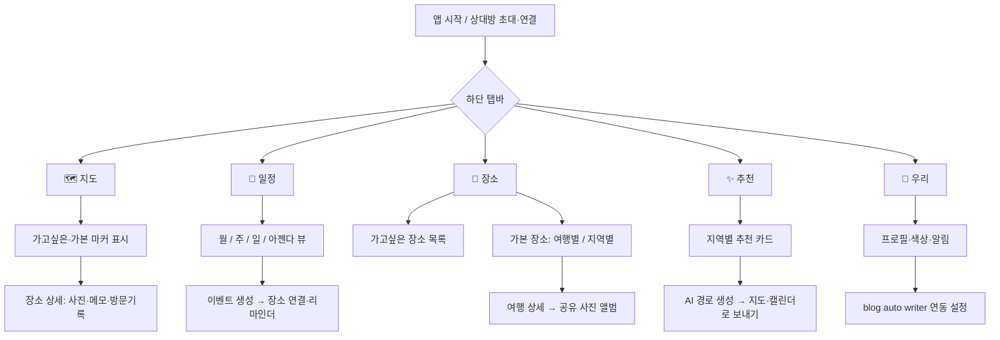
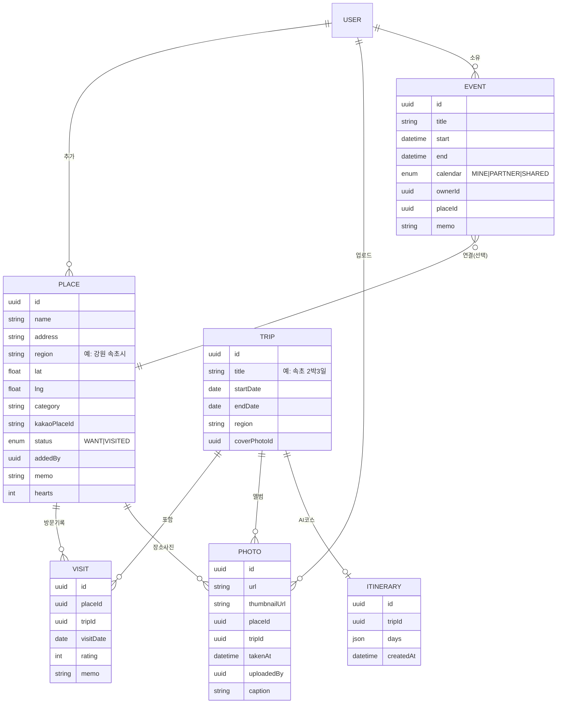

# 둘이 쓰는 여행 관리 앱 — 설계서

> 일정 공유 + 가고싶은/가본 장소 + 사진 앨범 + 지도 + AI 추천 경로.
> 사용자 2명(나 + 여자친구), 둘 다 iPhone, UX 최우선.

---

## 1. 설계 원칙

이 앱은 일반 서비스가 아니라 **둘만 쓰는 도구**라는 점이 모든 결정을 단순하게 만듭니다. 회원가입 퍼널, 권한 등급, 확장성, 멀티테넌시 같은 걱정은 거의 필요 없습니다. 대신 **공유가 기본값**이고, "누가 추가했는지" 같은 가벼운 출처 표시와 둘 사이의 실시간 동기화가 핵심 경험이 됩니다.

세 가지를 우선합니다. 첫째, **공유 우선** — 데이터는 기본적으로 둘 다 보고 편집할 수 있고, 개인 영역(내 일정)만 분리합니다. 둘째, **마찰 최소화** — 장소 하나 저장하는 데 탭 3번을 넘기지 않습니다. 셋째, **iOS 네이티브 감성** — 둘 다 아이폰이므로 안드로이드를 신경 쓸 필요가 없고, 그만큼 제스처·햅틱·전환 애니메이션을 마음껏 네이티브 수준으로 끌어올릴 수 있습니다.

---

## 2. 기술 스택 — 먼저 정해야 할 단 하나의 결정

나머지 설계는 스택과 거의 무관하지만, 구현 디테일은 여기서 갈립니다. 두 가지 현실적인 길이 있습니다.

| 항목 | A안 · 네이티브 (SwiftUI + CloudKit) | B안 · 크로스플랫폼 (Expo/React Native + Supabase) |
|---|---|---|
| UX 완성도 | 최상 (진짜 네이티브) | 매우 좋음 (거의 네이티브) |
| 학습 비용 | Swift/Xcode 필요, Mac 필수 | 이미 웹앱을 만든 경험 그대로 활용 가능 |
| 백엔드 | **불필요** — CloudKit 공유 영역이 둘의 동기화를 해결 | Supabase가 DB·인증·스토리지·실시간 제공 |
| 로그인 | iCloud 계정 = 신원 (구현 0) | 직접 구현 (둘이라 간단) |
| 사진 저장 | CloudKit Assets / iOS 공유 앨범 연동 | Supabase Storage |
| 비용 | 사실상 무료 (개인 한도 내) | 무료 티어로 시작, 사진 늘면 약간 과금 |
| 나중에 웹으로 확장 | 어려움 | 쉬움 |

**추천: 당신이 이미 웹앱(blog auto writer)을 만들어 본 개발자라면 B안(Expo + Supabase)이 더 빠른 길입니다.** 기존 JS 역량을 그대로 쓰고, Supabase가 둘의 공유·실시간·사진 저장을 한 번에 해결하며, blog auto writer가 웹 기반이라면 연동도 자연스럽습니다. 다만 "끝까지 폴리시된 네이티브 감성"과 "서버를 아예 안 두는 단순함"이 최우선이고 Swift 학습이 부담스럽지 않다면 **A안(SwiftUI + CloudKit)**이 더 우아합니다 — CloudKit의 공유 레코드 영역(shared zone)은 정확히 "둘이 같은 데이터를 편집"하는 시나리오를 위해 만들어진 기능이라 백엔드가 통째로 사라집니다.

> 이 문서의 데이터 모델·기능·UX는 두 안 모두에 그대로 적용됩니다. 스택만 정해주면 그 스택 기준 구현 디테일(SDK, 라이브러리, 코드 골격)을 더 채워드릴게요.

### 공통으로 필요한 작은 백엔드 레이어
어느 안이든 **API 키를 앱에 박으면 안 됩니다.** 카카오 로컬 API와 AI 경로 생성(Anthropic API) 호출은 얇은 서버리스 함수(Vercel / Cloudflare Workers / Supabase Edge Functions)를 프록시로 두고 그곳에서 키를 보관해 호출합니다. 앱 → 내 서버리스 함수 → 카카오/Claude 순서입니다.

---

## 3. 정보 구조(IA) & 네비게이션

하단 탭바 5개로 구성합니다. 각 탭은 하나의 명확한 질문에 답합니다.



- **🗺️ 지도** — 앱의 첫 화면. "우리가 가고 싶은 곳"과 "가봤던 곳"이 한눈에.
- **📅 일정** — 나/상대/함께 캘린더.
- **📍 장소** — 위시리스트와 방문 기록의 본진.
- **✨ 추천** — 데이터가 쌓이면 살아나는 탭.
- **💑 우리** — 설정, 연동, 둘의 프로필.

---

## 4. 데이터 모델

스택과 무관한 개념 모델입니다. CloudKit이면 레코드 타입, Supabase면 테이블로 1:1 매핑됩니다. 핵심 아이디어는 **여행(Trip)** 이라는 묶음을 둬서 "장소별·날짜별로 쉽게 보기"를 자연스럽게 푸는 것입니다.



설계상 중요한 선택 두 가지입니다. **`Place.status`** 하나로 가고싶은/가본을 구분하므로, 위시리스트에 있던 장소를 방문하면 새로 만들 필요 없이 상태만 `VISITED`로 바뀌고 `Visit` 기록이 붙습니다 — 위시리스트가 그대로 방문 일기가 됩니다. 그리고 **`Visit`를 별도 테이블로** 둔 덕에 같은 장소를 두 번 가도(예: 좋아하는 강릉 카페) 방문이 각각 남고, 여행(Trip)에 묶입니다.

`region`은 카카오 API가 돌려주는 주소에서 시/군/구를 파싱해 자동 채웁니다("강원특별자치도 속초시 ..." → `속초`). 이게 "지역별 보기"의 그룹 키가 됩니다.

---

## 5. 기능별 상세 설계

### 5.1 일정 — 3트랙 공유 캘린더

세 개의 논리 캘린더를 색으로 구분합니다: **나(예: 블루)**, **상대(핑크)**, **함께(퍼플)**. 구글 캘린더처럼 오버레이로 한 화면에 겹쳐 보되, 상단 칩으로 각 트랙을 켜고 끌 수 있습니다.

차용할 UX 레퍼런스는 명확합니다. 큰 틀과 인터랙션(월/주/일/아젠다 뷰, 색상 오버레이, 길게 눌러 생성, 드래그로 이동)은 **구글 캘린더**에서, 그리고 *커플·가족 공유 캘린더의 정석*인 **TimeTree**를 강하게 참고하세요 — TimeTree는 정확히 이 용도(둘이 한 캘린더를 공유, 일정에 코멘트·사진)로 만들어진 앱이라 거의 그대로 벤치마크가 됩니다. 깔끔한 타이포·키보드 중심 UX는 **Notion Calendar(구 Cron)**가 좋은 참고입니다.

이벤트는 제목·시간·**장소 연결(선택)**·메모·참석자(나/상대/둘 다)·리마인더를 가집니다. 여기서 핵심 연결고리: 이벤트에 `Place`를 붙이면 그 일정이 지도·장소 탭과 이어지고, 나중에 AI가 짠 코스를 **"함께" 캘린더에 그대로 꽂을 수 있습니다.**

동기화는 B안이면 Supabase Realtime, A안이면 CloudKit 공유 영역으로 자동 전파됩니다. MVP에서는 앱 안에 일정을 두고, 원하면 나중에 각자의 애플/구글 캘린더로 구독(.ics) 내보내기를 추가하면 됩니다.

### 5.2 가고싶은 장소 — 카카오 자동완성

추가 흐름은 검색 한 줄에서 끝납니다. 사용자가 입력하면 **카카오 로컬 키워드 검색 API**(`/v2/local/search/keyword`)를 디바운스(약 250ms)로 호출해 드롭다운에 후보를 띄우고, 선택하면 이름·주소·좌표·카테고리·카카오 장소 ID/URL이 한 번에 저장됩니다. 거기에 메모·태그·하트(우선순위)만 가볍게 얹습니다.

```
입력 "속초 칠" → [디바운스 250ms] → 서버리스 프록시 → 카카오 키워드 검색
   → ["칠성조선소", "칠성식당", ...] 드롭다운
   → 탭 → Place 저장 (status=WANT, addedBy=나, region=속초)
```

좌표를 저장하므로 지도 마커와 추천 클러스터링에 바로 쓰입니다. 카카오 API는 무료 쿼터(일·월 한도)가 넉넉해서 둘이 쓰는 데는 전혀 부족하지 않습니다.

### 5.3 가본 장소 — 여행별 · 지역별 보기

"속초, 강릉 등 장소별·날짜별로 쉽게"라는 요구는 **Trip(여행) 묶음**으로 풉니다. 며칠간 한 지역을 다녀오면 하나의 Trip("속초 2박3일", 날짜 범위)이 되고, 그 안에 방문 장소들과 사진이 담깁니다.

두 가지 보기를 제공합니다. **여행별(타임라인)** — 최근 여행부터 카드로 쭉, 각 카드에 커버 사진·지역·기간·장소 수. **지역별** — 속초/강릉/제주처럼 `region`으로 그룹핑해, 한 지역을 누르면 그곳의 모든 방문이 시간순으로. 위시리스트에서 가본 곳으로 전환하는 건 장소 상세에서 "다녀왔어요" 한 번 누르고 날짜·여행을 고르면 됩니다.

### 5.4 사진 — 장소별 공유 앨범

각 **여행 또는 장소**에 둘이 함께 채우는 공유 앨범이 붙습니다. 분류는 자동 + 수동을 섞습니다: 업로드 시 사진 EXIF의 촬영 시각·위치로 어느 여행/장소에 속하는지 **자동 추정**하고, 사용자는 필터 칩(여행 / 지역 / 날짜 / 태그)으로 추려 봅니다. 지도에서 마커를 누르면 그 장소의 사진만 모아 보는 식으로 지도와도 연결합니다.

저장 전략은 스택에 따릅니다 — B안은 Supabase Storage에 원본+썸네일을 올리고 URL을 `Photo`에 기록, A안은 CloudKit Asset 또는 iOS **공유 앨범** 연동을 활용합니다. 어느 쪽이든 그리드는 썸네일만 지연 로딩하고 원본은 탭할 때 받습니다(사진이 가장 무거운 비용 요인이므로).

### 5.5 지도 — 별표 마커로 한눈에

> **한국 지도 주의점:** 구글 지도는 국내 지도 데이터 반출 규제로 길찾기·상세가 제한적입니다. **카카오맵 SDK 또는 네이버 지도 SDK**(둘 다 한국 데이터 우수, 무료 티어)를 쓰세요. RN(B안)이라면 카카오/네이버를 네이티브 모듈 또는 WebView로 붙이고, A안이라면 카카오맵 iOS SDK를 권장합니다.

마커는 요청대로 **네이버 지도의 별표 모양**을 차용하되, 상태로 구분합니다 — 가고싶은 곳은 *빈/컬러 별(또는 하트)*, 가본 곳은 *채워진 별 + 체크* 같은 식으로. 줌아웃 시 클러스터링하고, 마커를 누르면 미니 카드(이름·사진 1장·상태)가 뜨고 상세로 진입합니다. 상단 필터로 "가고싶은 / 가본 / 전체"를 토글합니다. 둘이 추가한 장소를 작은 아바타 점으로 출처 표시해주면 "이거 네가 찜한 데네" 하는 재미가 생깁니다.

### 5.6 추천 & AI 경로 생성

**추천 트리거:** 같은 지역의 *가고싶은 장소*가 임계치(예: 3~5개) 이상 쌓이면 추천 탭에 카드가 뜹니다 — "강릉에 가보고 싶은 곳 5개가 모였어요. 코스로 짜볼까요?" 좌표 기준으로 위시리스트를 지역·근접도로 클러스터링해 후보 여행을 제안합니다.

**경로 생성(AI):** "경로 짜기"를 누르면 선택한 장소들과 제약(여행 날짜, 인원=2, 이동수단, 페이스: 느긋/빡빡, 선호: 맛집 위주 등)을 **Anthropic API(Claude)**로 보내 일자별 최적 동선을 받습니다.

설계 포인트:
- **왜 순수 알고리즘이 아니라 AI인가** — TSP 풀이는 "순서"는 주지만 "오전엔 바닷가, 점심은 근처 맛집, 오후엔 카페" 같은 맥락·끼니 배치·자연어 설명을 못 줍니다. 실무적으로는 둘을 결합하세요: 좌표로 대략적 최근접 순서를 미리 계산 → Claude가 그걸 다듬고 끼니·휴식·이유를 채워 넣음.
- **실제 이동시간**은 카카오모빌리티(내비) 또는 TMap 길찾기 API로 구간별 소요시간을 받아 AI 입력에 넣거나, 지도에 경로 폴리라인으로 그립니다(국내 길찾기는 카카오/TMap 권장).
- **입출력 계약** — 입력은 장소 배열(이름·좌표·카테고리·영업시간)+제약 JSON, 출력은 구조화 JSON(`days[] → stops[] {장소, 도착시각, 체류분, 이동메모, 추천이유}`). JSON으로 받아 화면에 렌더링.
- **루프 닫기** — 생성된 코스는 ① 지도에 동선으로 그리고 ② "함께 캘린더에 추가" 버튼으로 일정 이벤트들을 자동 생성합니다. 추천 → 코스 → 일정 → 여행 후 사진/방문기록까지 한 바퀴 도는 경험이 이 앱의 차별점입니다.

---

## 6. 외부 연동 요약

| 용도 | 추천 | 비고 |
|---|---|---|
| 장소 검색·자동완성 | **카카오 로컬 API** (키워드 검색) | 무료 쿼터, 한국 장소 강함, 좌표·카테고리·장소 URL 제공 |
| 지도 표시 | **카카오맵 / 네이버 지도 SDK** | 구글은 국내 규제로 부적합 |
| 길찾기·이동시간 | 카카오모빌리티 / TMap API | AI 입력·동선 폴리라인용 |
| AI 경로 생성 | **Anthropic API (Claude)** | 서버리스 프록시 경유, 구조화 JSON 출력 |
| 인증·DB·실시간·사진 | A안 CloudKit / B안 Supabase | 스택 결정에 종속 |

모든 외부 키는 앱이 아니라 서버리스 프록시에 보관합니다.

---

## 7. blog auto writer 연동

> 당신의 블로그가 정적 사이트(Jekyll/GitHub Pages 계열)로 보이는데, blog auto writer가 정확히 어떤 형태(웹 서비스인지, 글 생성기인지)냐에 따라 *전송 방식*이 갈립니다. 그래서 **전송 방식과 무관하게 안정적인 데이터 계약(payload)**부터 정의하고, 거기에 맞는 운반책 3가지를 제시합니다.

**핸드오프 페이로드(고정 스키마):** 여행 앱에서 장소/여행 하나를 골라 "블로그로 보내기"를 누르면 아래 JSON이 만들어집니다.

```json
{
  "place": "칠성조선소",
  "region": "속초",
  "dates": ["2026-05-10", "2026-05-11"],
  "coordinates": { "lat": 38.20, "lng": 128.59 },
  "memo": "뷰가 좋았던 카페, 노을 추천",
  "mapUrl": "https://...",
  "photos": [
    { "url": "https://.../1.jpg", "caption": "노을", "takenAt": "..." }
  ]
}
```

**운반책 (blog auto writer 형태에 맞춰 택1):**
1. **REST/Webhook** — blog auto writer가 웹 서비스라면 `POST /import` 엔드포인트를 열어 위 JSON을 받게 합니다. 가장 깔끔.
2. **정적 블로그용 초안 생성** — Jekyll이라면, 앱이 프론트매터가 박힌 `_drafts/2026-05-10-속초-칠성조선소.md` 초안과 `/assets`에 이미지들을 만들어 GitHub API로 푸시 → blog auto writer가 스타일링/발행을 마무리. 정적 블로그 구조에 가장 자연스러움.
3. **iOS 공유 시트 / 단축어(Shortcuts)** — 앱이 공유 액션을 제공해 선택 사진+캡션을 blog auto writer로 넘김(URL 스킴/단축어 수신 시). 코딩 최소.

스키마는 고정해 두고 운반책만 교체하면 되므로, blog auto writer의 실제 형태를 알려주면 그에 맞춰 한 가지로 좁혀 설계해드릴 수 있습니다.

---

## 8. UX 디테일 (둘만 쓰는 앱의 강점 살리기)

iOS HIG를 따르되 둘만의 도구라는 점을 살립니다. SF Symbols·라지 타이틀·스와이프·롱프레스 컨텍스트 메뉴·당겨서 새로고침을 기본으로 쓰고, 장소 저장 시 하트 애니메이션·마커 드롭·탭 전환에 부드러운 모션과 햅틱을 넣습니다.

둘만의 경험을 위한 디테일: 모든 항목에 **누가 추가/편집했는지** 작은 아바타로 출처를 표시하고, 장소·사진에 가벼운 ❤️ 리액션을 허용하되 무거운 소셜 기능은 넣지 않습니다. 알림은 일정 리마인더 외에 "상대가 새 장소를 추가했어요", "○○ 여행 D-3" 같은 둘 사이의 신호로 한정합니다.

온보딩은 최소화합니다 — 상대 초대/연결, 캘린더 색상 두 개 고르기로 끝. 빈 상태도 친근하게("첫 가고싶은 장소를 추가해보세요")입니다.

---

## 9. 개발 로드맵

데이터가 쌓여야 가치가 생기는 앱이므로, **위시리스트+지도**부터 만들어 빨리 쓰기 시작하는 게 핵심입니다.

| 단계 | 범위 | 목표 |
|---|---|---|
| 0 | 스택 결정, 프로젝트 셋업, 상대 연결/공유 인프라, 서버리스 프록시 | 토대 |
| 1 (MVP) | 가고싶은 장소(카카오 자동완성) + 지도 별표 마커 + 공유 | **핵심 루프** — 바로 쓰기 시작 |
| 2 | 3트랙 공유 캘린더 (장소 연결 포함) | 일정 |
| 3 | 가본 장소 + 여행(Trip) + 공유 사진 앨범 | 기록 |
| 4 | 지역별 추천 + AI 경로 생성 → 지도·캘린더 연동 | 차별화 |
| 5 | blog auto writer 연동, UX 폴리시·애니메이션·알림 | 마감 |

---

## 10. 보안 · 프라이버시 메모

둘만의 사적인 데이터(사진·동선·일정)인 만큼, **모든 API 키는 앱이 아닌 서버리스 프록시에 보관**하고, 사진/위치 접근은 iOS 권한을 정직하게 요청합니다. 계정 연결은 둘 사이 초대 코드/링크로만 이뤄지게 해 제3자 유입을 막습니다. CloudKit(A안)은 데이터가 둘의 iCloud에 머물러 프라이버시에 유리하고, Supabase(B안)는 Row Level Security로 "이 두 사용자만 접근" 정책을 거는 것을 잊지 마세요.
